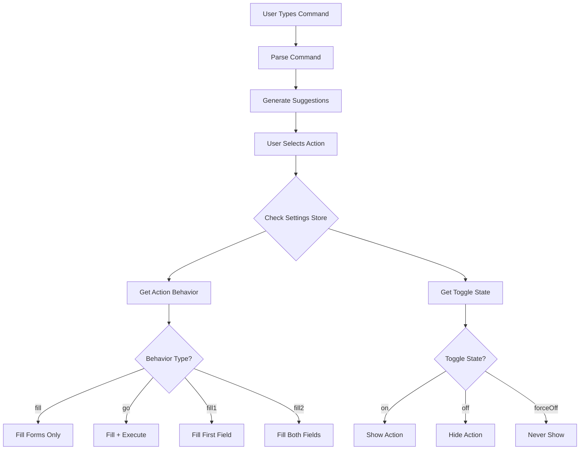

# SmartSearch Settings Implementation Plan

**Document Version**: 1.0  
**Last Updated**: December 2024  
**Status**: Planning Phase - Awaiting Implementation Approval

## 📋 Table of Contents

1. [Overview](#overview)
2. [Requirements Analysis](#requirements-analysis)
3. [Architecture Design](#architecture-design)
4. [Store Implementation](#store-implementation)
5. [UI/UX Implementation Options](#uiux-implementation-options)
6. [Behavior Implementation Plan](#behavior-implementation-plan)
7. [Technical Implementation Details](#technical-implementation-details)
8. [Mobile Considerations](#mobile-considerations)
9. [Testing Strategy](#testing-strategy)
10. [Phased Rollout Plan](#phased-rollout-plan)
11. [Future Enhancements](#future-enhancements)

---

## 🎯 Overview

This document outlines the comprehensive implementation plan for adding user-configurable settings to the SmartSearchRefactor component. The feature will allow users to customize how smart search commands behave while respecting backend-controlled visibility toggles.

### Core Goals

- **User Control**: Allow users to configure action behaviors (fill forms vs auto-execute)
- **Backend Control**: Respect admin-configured action visibility toggles
- **Discoverability**: Make settings easily accessible from the search interface
- **Consistency**: Follow established UI patterns in the codebase
- **Persistence**: Store user preferences across sessions

---

## 📊 Requirements Analysis

### Functional Requirements

#### User-Modifiable Settings

- **Pool Actions**: `fill1` | `fill2` | `go` (default: `fill1`)

  - `fill1`: Fill only the first token field
  - `fill2`: Fill both token fields
  - `go`: Fill fields and execute action automatically

- **Standard Actions**: `fill` | `go` (default: `fill`)
  - `fill`: Fill form fields only
  - `go`: Fill fields and execute action automatically
  - Applies to: `swap`, `stake`, `unstake`, `withdraw`

#### Backend-Controlled Toggles

- **Action Visibility**: `forceOff` | `on` | `off`
  - `forceOff`: Always disabled, not shown to users
  - `on`: Available and enabled by default
  - `off`: Available but disabled by default
  - Controls: `poolActions`, `swapActions`, `stakeActions`, `withdrawActions`, `claimActions`, `sendActions`, `receiveActions`

### Non-Functional Requirements

- **Performance**: Settings access should not impact search performance
- **Accessibility**: Full keyboard navigation and screen reader support
- **Responsive**: Work seamlessly on mobile and desktop
- **Persistence**: Settings stored in `sessionStorage` for session-level persistence

---

## 🏗️ Architecture Design

### Component Hierarchy

```
SmartSearchRefactor/
├── SmartSearchBox.tsx (enhanced with settings integration)
├── components/
│   ├── TokenPill.tsx (existing)
│   └── SmartSearchSettings/ (new)
│       ├── index.tsx
│       ├── SettingsButton.tsx
│       ├── SettingsModal.tsx
│       ├── SettingGroup.tsx
│       └── BehaviorSelector.tsx
├── constants/ (existing)
├── utils/ (existing)
└── types.ts (enhanced)
```

### Data Flow



---

## 💾 Store Implementation

### Store Structure (Already Implemented)

The `smartSearchSettingsStore.ts` has been implemented with the following structure:

```typescript
// Enums
export enum PoolBehavior {
  FILL1 = 'fill1', // Fill only first field
  FILL2 = 'fill2', // Fill both fields
  GO = 'go', // Fill and execute
}

export enum ActionBehavior {
  FILL = 'fill', // Fill form only
  GO = 'go', // Fill and execute
}

export enum ToggleState {
  FORCE_OFF = 'forceOff', // Always disabled
  ON = 'on', // User can enable/disable (default on)
  OFF = 'off', // User can enable/disable (default off)
}

// Store Interface
export interface SmartSearchSettingsStore {
  // User-modifiable settings
  poolValues: PoolBehavior;
  swapValues: ActionBehavior;
  stakeValues: ActionBehavior;
  unstakeValues: ActionBehavior;
  withdrawValues: ActionBehavior;

  // Backend-controlled toggles
  poolActions: ToggleState;
  swapActions: ToggleState;
  stakeActions: ToggleState;
  withdrawActions: ToggleState;
  claimActions: ToggleState;
  sendActions: ToggleState;
  receiveActions: ToggleState;

  // Actions
  setPoolBehavior: (behavior: PoolBehavior) => void;
  setActionBehavior: (action: string, behavior: ActionBehavior) => void;
  setToggle: (toggle: string, state: ToggleState) => void;
}
```

### Store Integration Pattern

```typescript
// Usage in SmartSearchBox
const {
  // User preferences
  poolValues,
  swapValues,
  stakeValues,
  // Backend toggles
  poolActions,
  swapActions,
  stakeActions,
  // Actions
  setActionBehavior,
  setToggle,
} = useSmartSearchSettingsStore();

// Filter suggestions based on backend toggles
const isActionEnabled = (action: string): boolean => {
  const toggleMap = {
    swap: swapActions,
    pool: poolActions,
    stake: stakeActions,
    // ...
  };
  return toggleMap[action] === ToggleState.ON;
};

// Get user behavior preference
const getBehavior = (action: string) => {
  const behaviorMap = {
    swap: swapValues,
    pool: poolValues,
    stake: stakeValues,
    // ...
  };
  return behaviorMap[action];
};
```

---

## 🎨 UI/UX Implementation Options

### Option 1: Inline Settings Button (Recommended)

**Location**: Next to the SmartSearchBox  
**Pattern**: Radix Dialog modal similar to existing token selection modals

```typescript
// Layout
<div className="flex items-center gap-2">
  <SmartSearchBox className="flex-1" />
  <SmartSearchSettingsButton />
</div>

// Modal structure (following TokenSelectionModal pattern)
<Dialog.Root>
  <Dialog.Trigger asChild>
    <button aria-label="Search settings">
      <RiSettings3Line className="w-5 h-5" />
    </button>
  </Dialog.Trigger>
  <Dialog.Content className="fixed top-1/2 left-1/2 transform -translate-x-1/2 -translate-y-1/2
    bg-adamant-app-box rounded-xl w-full max-w-md min-w-[400px] py-6 outline-none z-50">
    <SmartSearchSettingsModal />
  </Dialog.Content>
</Dialog.Root>
```

**Pros**:

- High discoverability
- Consistent with existing modal patterns
- Clear contextual relationship with search

**Cons**:

- Adds visual element to search area
- Requires responsive handling

### Option 2: Dropdown Integration

**Location**: Within the SmartSearchBox popover  
**Pattern**: Additional tab/view in existing suggestions dropdown

```typescript
// Enhanced popover content
<Popover.Content>
  {showSettings ? <SettingsPanel /> : <SuggestionsList />}
  <div className="border-t p-2">
    <button onClick={() => setShowSettings(!showSettings)}>
      {showSettings ? 'Back to search' : 'Settings'}
    </button>
  </div>
</Popover.Content>
```

**Pros**:

- No additional UI chrome
- Reuses existing popover infrastructure

**Cons**:

- Less discoverable
- Complex state management
- Potential UX confusion

### Option 3: Global Settings Integration

**Location**: Within UserWallet settings panel  
**Pattern**: Additional section in existing settings modal

```typescript
// In WalletSidebar.tsx settings view
{
  currentView === 'settings' && (
    <div className="space-y-6">
      <SmartSearchSettings />
      <BalanceSettings />
      <ContractKeysSettings />
    </div>
  );
}
```

**Pros**:

- Centralized settings location
- No search UI changes needed

**Cons**:

- Poor discoverability
- Requires navigation away from search context

### Recommended Approach: Option 1

Option 1 provides the best balance of discoverability, consistency, and user experience while following established patterns in the codebase.

---

## ⚙️ Behavior Implementation Plan

### Command Execution Flow

The core implementation revolves around intercepting command execution and applying user preferences before proceeding.

```typescript
// Enhanced executeCommand function
const executeCommand = useCallback(
  async (command: ParsedCommand) => {
    // 1. Get user behavior preference
    const behavior = getBehaviorForAction(command.action);
    const shouldAutoExecute = behavior === ActionBehavior.GO || behavior === PoolBehavior.GO;

    // 2. Handle action based on type
    switch (command.action) {
      case 'swap':
        await handleSwapCommand(command, shouldAutoExecute);
        break;
      case 'deposit':
      case 'pool':
        await handlePoolCommand(command, behavior);
        break;
      case 'stake':
        await handleStakeCommand(command, shouldAutoExecute);
        break;
      // ... other actions
    }
  },
  [
    /* dependencies */
  ]
);
```

### Swap Action Implementation

```typescript
const handleSwapCommand = async (command: ParsedCommand, shouldAutoExecute: boolean) => {
  setIsLoading(true);
  try {
    // Always fill form state
    setTokenInputProperty('swap.pay', 'tokenAddress', command.fromToken.address);
    setTokenInputProperty('swap.receive', 'tokenAddress', command.toToken.address);
    if (command.amount) {
      setTokenInputProperty('swap.pay', 'amount', command.amount);
    }

    // Navigate to swap page if needed
    if (router.pathname !== '/') {
      await router.push('/');
    }

    setIsOpen(false);

    if (shouldAutoExecute) {
      // Wait for estimation and execute
      await waitForEstimationAndExecuteSwap();
    }
    // For 'fill' behavior, stop here
  } finally {
    setIsLoading(false);
  }
};
```

### Pool/Deposit Action Implementation

```typescript
const handlePoolCommand = async (command: ParsedCommand, behavior: PoolBehavior) => {
  const queryParams = new URLSearchParams();

  // Handle different fill behaviors
  switch (behavior) {
    case PoolBehavior.FILL1:
      // Fill only the specified token
      queryParams.append('token', command.fromToken.symbol);
      if (command.amount) queryParams.append('amount', command.amount);
      break;

    case PoolBehavior.FILL2:
      // Fill both tokens in the pair
      const pool = findPoolByContract(command.target);
      if (pool) {
        queryParams.append('token1', command.fromToken.symbol);
        if (command.amount) queryParams.append('amount1', command.amount);

        // Determine the other token in the pair
        const otherToken = pool.token0 === command.fromToken.symbol ? pool.token1 : pool.token0;
        queryParams.append('token2', otherToken);
      }
      break;

    case PoolBehavior.GO:
      // Fill and mark for auto-execution
      queryParams.append('token', command.fromToken.symbol);
      if (command.amount) queryParams.append('amount', command.amount);
      queryParams.append('execute', 'true');
      break;
  }

  // Navigate to pool page with params
  await router.push(`/pool/${command.target}?${queryParams.toString()}`);
  setIsOpen(false);
};
```

### Page-Level Integration

For actions that navigate to other pages, those pages need to read URL parameters and pre-fill forms:

```typescript
// pages/pool/[pool].tsx
const PoolPage = () => {
  const router = useRouter();
  const { setToken, setAmount, handleDeposit } = usePoolStore();

  useEffect(() => {
    const { token, token1, token2, amount, amount1, execute } = router.query;

    // Handle single token fill (FILL1)
    if (token && typeof token === 'string') {
      const tokenData = findTokenBySymbol(token);
      if (tokenData) setToken('first', tokenData.address);
    }

    // Handle dual token fill (FILL2)
    if (token1 && token2 && typeof token1 === 'string' && typeof token2 === 'string') {
      const token1Data = findTokenBySymbol(token1);
      const token2Data = findTokenBySymbol(token2);
      if (token1Data) setToken('first', token1Data.address);
      if (token2Data) setToken('second', token2Data.address);
    }

    // Handle amounts
    if (amount && typeof amount === 'string') {
      setAmount('first', amount);
    }
    if (amount1 && typeof amount1 === 'string') {
      setAmount('first', amount1);
    }

    // Handle auto-execution (GO behavior)
    if (execute === 'true') {
      // Delay execution to ensure form is populated
      setTimeout(() => {
        handleDeposit();
      }, 500);
    }
  }, [router.query]);

  // ... rest of component
};
```

---

## 🔧 Technical Implementation Details

### Component Structure

#### SmartSearchSettingsButton

```typescript
interface SmartSearchSettingsButtonProps {
  className?: string;
}

export const SmartSearchSettingsButton: React.FC<SmartSearchSettingsButtonProps> = ({
  className = '',
}) => {
  const [isOpen, setIsOpen] = useState(false);

  return (
    <Dialog.Root open={isOpen} onOpenChange={setIsOpen}>
      <Dialog.Trigger asChild>
        <button
          className={`p-2 rounded-lg hover:bg-adamant-app-input transition-colors ${className}`}
          aria-label="Search settings"
        >
          <RiSettings3Line className="w-5 h-5 text-adamant-text-box-secondary" />
        </button>
      </Dialog.Trigger>
      <Dialog.Portal>
        <Dialog.Overlay className="fixed inset-0 bg-black/50 backdrop-blur-sm z-50" />
        <Dialog.Content
          className="fixed top-1/2 left-1/2 transform -translate-x-1/2 -translate-y-1/2 
          bg-adamant-app-box rounded-xl w-full max-w-md min-w-[400px] py-6 outline-none z-50 
          shadow-2xl border border-adamant-box-border animate-in fade-in-0 zoom-in-95 duration-200"
        >
          <SmartSearchSettingsModal onClose={() => setIsOpen(false)} />
        </Dialog.Content>
      </Dialog.Portal>
    </Dialog.Root>
  );
};
```

#### SmartSearchSettingsModal

```typescript
interface SmartSearchSettingsModalProps {
  onClose: () => void;
}

export const SmartSearchSettingsModal: React.FC<SmartSearchSettingsModalProps> = ({ onClose }) => {
  const {
    // User preferences
    poolValues,
    swapValues,
    stakeValues,
    unstakeValues,
    withdrawValues,
    // Backend toggles
    poolActions,
    swapActions,
    stakeActions,
    withdrawActions,
    // Actions
    setPoolBehavior,
    setActionBehavior,
  } = useSmartSearchSettingsStore();

  return (
    <div className="flex flex-col h-full">
      {/* Header */}
      <div className="flex justify-between items-center px-6 pb-4 border-b border-adamant-box-border">
        <div>
          <Dialog.Title className="text-xl font-bold text-adamant-text-box-main">
            Search Settings
          </Dialog.Title>
          <p className="text-sm text-adamant-text-box-secondary mt-1">
            Configure how search commands behave
          </p>
        </div>
        <Dialog.Close asChild>
          <button className="p-2 hover:bg-adamant-app-input rounded-lg transition-colors">
            <X className="w-5 h-5 text-adamant-text-box-secondary" />
          </button>
        </Dialog.Close>
      </div>

      {/* Settings Content */}
      <div className="flex-1 px-6 py-4 space-y-6 overflow-y-auto">
        {/* Only show settings for enabled actions */}
        {swapActions === ToggleState.ON && (
          <SettingGroup
            title="Swap Behavior"
            description="How swap commands should behave"
            options={[
              {
                value: ActionBehavior.FILL,
                label: 'Fill forms only',
                description: 'Populate swap form without executing',
              },
              {
                value: ActionBehavior.GO,
                label: 'Fill and execute',
                description: 'Populate form and perform swap automatically',
              },
            ]}
            value={swapValues}
            onChange={(value) => setActionBehavior('swapValues', value)}
          />
        )}

        {poolActions === ToggleState.ON && (
          <SettingGroup
            title="Pool/Deposit Behavior"
            description="How pool deposit commands should behave"
            options={[
              {
                value: PoolBehavior.FILL1,
                label: 'Fill first field only',
                description: 'Populate only the specified token',
              },
              {
                value: PoolBehavior.FILL2,
                label: 'Fill both fields',
                description: 'Populate both tokens in the pair',
              },
              {
                value: PoolBehavior.GO,
                label: 'Fill and execute',
                description: 'Populate form and perform deposit automatically',
              },
            ]}
            value={poolValues}
            onChange={setPoolBehavior}
          />
        )}

        {stakeActions === ToggleState.ON && (
          <SettingGroup
            title="Stake Behavior"
            description="How stake commands should behave"
            options={[
              {
                value: ActionBehavior.FILL,
                label: 'Fill forms only',
                description: 'Populate stake form without executing',
              },
              {
                value: ActionBehavior.GO,
                label: 'Fill and execute',
                description: 'Populate form and perform stake automatically',
              },
            ]}
            value={stakeValues}
            onChange={(value) => setActionBehavior('stakeValues', value)}
          />
        )}

        {/* Additional actions... */}
      </div>

      {/* Footer */}
      <div className="px-6 pt-4 border-t border-adamant-box-border">
        <div className="text-xs text-adamant-text-box-secondary">
          Settings are saved automatically and persist for your session.
        </div>
      </div>
    </div>
  );
};
```

#### SettingGroup Component

```typescript
interface SettingOption<T> {
  value: T;
  label: string;
  description: string;
}

interface SettingGroupProps<T> {
  title: string;
  description: string;
  options: SettingOption<T>[];
  value: T;
  onChange: (value: T) => void;
}

export function SettingGroup<T>({
  title,
  description,
  options,
  value,
  onChange,
}: SettingGroupProps<T>) {
  return (
    <div className="space-y-3">
      <div>
        <h3 className="text-lg font-semibold text-adamant-text-box-main">{title}</h3>
        <p className="text-sm text-adamant-text-box-secondary">{description}</p>
      </div>

      <div className="space-y-2">
        {options.map((option) => (
          <button
            key={String(option.value)}
            onClick={() => onChange(option.value)}
            className={`w-full text-left p-3 rounded-lg border transition-all duration-200 ${
              value === option.value
                ? 'bg-adamant-accentText/10 border-adamant-accentText text-adamant-text-box-main'
                : 'bg-adamant-box-dark border-adamant-box-border hover:border-adamant-box-border-highlight text-adamant-text-box-main hover:bg-adamant-box-regular'
            }`}
          >
            <div className="flex items-start justify-between">
              <div className="flex-1">
                <div className="font-medium">{option.label}</div>
                <div className="text-sm text-adamant-text-box-secondary mt-1">
                  {option.description}
                </div>
              </div>
              {value === option.value && (
                <Check className="w-5 h-5 text-adamant-accentText ml-2 flex-shrink-0" />
              )}
            </div>
          </button>
        ))}
      </div>
    </div>
  );
}
```

### Integration with SmartSearchBox

```typescript
// Enhanced SmartSearchBox component
export const SmartSearchBox: React.FC<SmartSearchBoxProps> = ({
  className = '',
  placeholder,
  isMobile = false,
}) => {
  // ... existing state and hooks

  // Add settings store integration
  const {
    poolValues,
    swapValues,
    stakeValues,
    unstakeValues,
    withdrawValues,
    poolActions,
    swapActions,
    stakeActions,
    withdrawActions,
    claimActions,
    sendActions,
    receiveActions,
  } = useSmartSearchSettingsStore();

  // Filter suggestions based on backend toggles
  const suggestions = useMemo(
    () => {
      const baseSuggestions = generateSuggestions({
        query,
        parsedCommand,
        router,
        executeCommand,
        setQuery,
        inputRef,
      });

      return baseSuggestions.filter((suggestion) => {
        if (suggestion.type === 'command' && suggestion.command?.action) {
          const action = suggestion.command.action;
          const toggleMap: Record<string, ToggleState> = {
            swap: swapActions,
            pool: poolActions,
            deposit: poolActions,
            stake: stakeActions,
            unstake: stakeActions,
            withdraw: withdrawActions,
            claim: claimActions,
            send: sendActions,
            receive: receiveActions,
          };

          const toggleState = toggleMap[action];
          return toggleState === ToggleState.ON;
        }
        return true;
      });
    },
    [
      /* ... dependencies ..., swapActions, poolActions, etc. */
    ]
  );

  // Enhanced executeCommand with behavior handling
  const executeCommand = useCallback(
    async (command: ParsedCommand) => {
      const getBehaviorForAction = (action: string) => {
        const behaviorMap: Record<string, ActionBehavior | PoolBehavior> = {
          swap: swapValues,
          pool: poolValues,
          deposit: poolValues,
          stake: stakeValues,
          unstake: unstakeValues,
          withdraw: withdrawValues,
        };
        return behaviorMap[action] || ActionBehavior.FILL;
      };

      const behavior = getBehaviorForAction(command.action || '');
      const shouldAutoExecute = behavior === ActionBehavior.GO || behavior === PoolBehavior.GO;

      // Handle different actions based on behavior
      // ... implementation as detailed in previous sections
    },
    [
      /* ... dependencies ..., all behavior values */
    ]
  );

  // ... rest of component with enhanced executeCommand

  return (
    <div className={`flex items-center gap-2 ${className}`}>
      <div className="flex-1">{/* Existing SmartSearchBox JSX */}</div>
      {!isMobile && <SmartSearchSettingsButton />}
    </div>
  );
};
```

---

## 📱 Mobile Considerations

### Mobile Layout Strategy

On mobile devices, the settings button should be integrated into the existing mobile search modal to avoid UI clutter.

```typescript
// Enhanced MobileSearchButton.tsx
export const MobileSearchButton: React.FC = () => {
  const [isOpen, setIsOpen] = useState(false);

  return (
    <Dialog.Root open={isOpen} onOpenChange={setIsOpen}>
      <Dialog.Trigger asChild>
        <button
          className="p-2.5 rounded-lg bg-adamant-app-input hover:bg-adamant-app-input/90 border border-adamant-box-inputBorder transition-all duration-200"
          aria-label="Open search"
        >
          <Search className="w-5 h-5 text-adamant-text-box-secondary" />
        </button>
      </Dialog.Trigger>

      <Dialog.Portal>
        <Dialog.Content asChild>
          <motion.div className="fixed top-4 left-4 right-4 z-50 max-w-lg mx-auto">
            <div className={`${INPUT_STYLES.infoContainer} p-4`}>
              <div className="flex items-center justify-between mb-4">
                <Dialog.Title className="text-lg font-semibold text-adamant-text-box-main">
                  Search
                </Dialog.Title>
                <div className="flex items-center gap-2">
                  <SmartSearchSettingsButton className="text-adamant-text-box-secondary hover:text-adamant-text-box-main" />
                  <Dialog.Close asChild>
                    <button className="p-1 rounded-lg hover:bg-adamant-app-input/50 transition-colors">
                      <X className="w-5 h-5 text-adamant-text-box-secondary" />
                    </button>
                  </Dialog.Close>
                </div>
              </div>

              <SmartSearchBox
                isMobile={true}
                placeholder="Type a command like 'swap 10 secret for usdc'"
              />
            </div>
          </motion.div>
        </Dialog.Content>
      </Dialog.Portal>
    </Dialog.Root>
  );
};
```

### Mobile Settings Modal

On mobile, the settings modal should be full-screen or nearly full-screen for better usability:

```typescript
// Mobile-optimized settings modal
const isMobile = useMediaQuery('(max-width: 768px)');

<Dialog.Content className={`fixed outline-none z-50 shadow-2xl border border-adamant-box-border
  animate-in fade-in-0 zoom-in-95 duration-200 ${
    isMobile
      ? 'inset-4 rounded-xl bg-adamant-app-box' // Nearly full-screen on mobile
      : 'top-1/2 left-1/2 transform -translate-x-1/2 -translate-y-1/2 bg-adamant-app-box rounded-xl w-full max-w-md min-w-[400px] py-6'
  }`}>
```

---

## 🧪 Testing Strategy

### Unit Tests

#### Store Tests

```typescript
// store/smartSearchSettingsStore.test.ts
describe('SmartSearchSettingsStore', () => {
  beforeEach(() => {
    // Reset store to defaults
  });

  test('should have correct default values', () => {
    const { poolValues, swapValues } = useSmartSearchSettingsStore.getState();
    expect(poolValues).toBe(PoolBehavior.FILL1);
    expect(swapValues).toBe(ActionBehavior.FILL);
  });

  test('should update pool behavior', () => {
    const { setPoolBehavior } = useSmartSearchSettingsStore.getState();
    setPoolBehavior(PoolBehavior.GO);

    const { poolValues } = useSmartSearchSettingsStore.getState();
    expect(poolValues).toBe(PoolBehavior.GO);
  });

  test('should persist settings in sessionStorage', () => {
    const { setActionBehavior } = useSmartSearchSettingsStore.getState();
    setActionBehavior('swapValues', ActionBehavior.GO);

    // Simulate page reload
    // Verify settings are restored from sessionStorage
  });
});
```

#### Component Tests

```typescript
// components/SmartSearchSettings/SmartSearchSettingsModal.test.tsx
describe('SmartSearchSettingsModal', () => {
  test('should only show settings for enabled actions', () => {
    // Mock store with some actions disabled
    render(<SmartSearchSettingsModal onClose={jest.fn()} />);

    // Verify only enabled sections are rendered
    expect(screen.getByText('Swap Behavior')).toBeInTheDocument();
    expect(screen.queryByText('Disabled Action')).not.toBeInTheDocument();
  });

  test('should update settings when user selects option', () => {
    const { setActionBehavior } = useSmartSearchSettingsStore.getState();
    render(<SmartSearchSettingsModal onClose={jest.fn()} />);

    fireEvent.click(screen.getByText('Fill and execute'));

    expect(setActionBehavior).toHaveBeenCalledWith('swapValues', ActionBehavior.GO);
  });
});
```

### Integration Tests

#### Command Execution Tests

```typescript
// SmartSearchBox.integration.test.tsx
describe('SmartSearchBox Command Execution', () => {
  test('should fill forms only when behavior is FILL', async () => {
    // Set up store with FILL behavior
    const { setActionBehavior } = useSmartSearchSettingsStore.getState();
    setActionBehavior('swapValues', ActionBehavior.FILL);

    render(<SmartSearchBox />);

    // Type swap command and execute
    fireEvent.change(screen.getByRole('combobox'), {
      target: { value: 'swap 10 usdc for scrt' },
    });
    fireEvent.click(screen.getByText(/Execute/));

    // Verify form is filled but swap is not executed
    expect(mockSetTokenInputProperty).toHaveBeenCalled();
    expect(mockHandleSwapClick).not.toHaveBeenCalled();
  });

  test('should auto-execute when behavior is GO', async () => {
    // Set up store with GO behavior
    const { setActionBehavior } = useSmartSearchSettingsStore.getState();
    setActionBehavior('swapValues', ActionBehavior.GO);

    render(<SmartSearchBox />);

    // Type swap command and execute
    fireEvent.change(screen.getByRole('combobox'), {
      target: { value: 'swap 10 usdc for scrt' },
    });
    fireEvent.click(screen.getByText(/Execute/));

    // Verify form is filled and swap is executed
    expect(mockSetTokenInputProperty).toHaveBeenCalled();
    await waitFor(() => {
      expect(mockHandleSwapClick).toHaveBeenCalled();
    });
  });
});
```

### Manual Testing Scenarios

#### Behavior Testing

1. **Fill Behavior**:

   - Set swap behavior to "Fill"
   - Execute "swap 10 usdc for scrt"
   - Verify: Form populated, no automatic execution
   - Verify: User can manually trigger swap

2. **Go Behavior**:

   - Set swap behavior to "Go"
   - Execute "swap 10 usdc for scrt"
   - Verify: Form populated and swap executes automatically
   - Verify: Loading states and feedback are shown

3. **Pool Fill1 Behavior**:

   - Set pool behavior to "Fill1"
   - Execute "deposit 100 usdc in pool-contract-address"
   - Verify: Only USDC field populated
   - Verify: Second token field remains empty

4. **Pool Fill2 Behavior**:
   - Set pool behavior to "Fill2"
   - Execute "deposit 100 usdc in usdc-scrt-pool"
   - Verify: USDC field populated with amount
   - Verify: SCRT field populated (without amount)

#### Toggle Testing

1. **Backend Toggle Disabled**:

   - Set `swapActions` to `ToggleState.FORCE_OFF`
   - Verify: Swap commands don't appear in suggestions
   - Verify: Settings UI doesn't show swap options

2. **Backend Toggle Enabled**:
   - Set `stakeActions` to `ToggleState.ON`
   - Verify: Stake commands appear in suggestions
   - Verify: Settings UI shows stake behavior options

#### Accessibility Testing

1. **Keyboard Navigation**:

   - Tab to settings button
   - Press Enter to open modal
   - Navigate settings with Tab/Arrow keys
   - Test Esc to close modal

2. **Screen Reader**:
   - Verify ARIA labels and descriptions
   - Test focus announcements
   - Verify modal accessibility

---

## 🚀 Phased Rollout Plan

### Phase 1: Core Implementation (MVP)

**Timeline**: 1-2 weeks  
**Scope**: Basic settings functionality

#### Deliverables:

- [ ] Settings store integration with SmartSearchBox
- [ ] Settings button and modal UI components
- [ ] Basic behavior implementation for `swap` action
- [ ] Fill vs Go behavior for swap commands
- [ ] Backend toggle filtering for suggestions
- [ ] Basic unit tests for store and components

#### Success Criteria:

- Users can open settings modal and configure swap behavior
- Swap commands respect user preferences (fill vs go)
- Only enabled actions appear in suggestions
- Settings persist across browser session

### Phase 2: Extended Actions (Enhanced)

**Timeline**: 1-2 weeks  
**Scope**: Pool, stake, and other action behaviors

#### Deliverables:

- [ ] Pool deposit behavior implementation (fill1, fill2, go)
- [ ] Stake/unstake behavior implementation
- [ ] Withdraw behavior implementation
- [ ] URL parameter handling for navigation actions
- [ ] Page-level integration for pool/stake pages
- [ ] Mobile responsive settings modal
- [ ] Integration tests for all behaviors

#### Success Criteria:

- Pool commands support all three behaviors correctly
- Stake/withdraw commands work with fill/go behaviors
- Mobile settings modal provides good UX
- Navigation-based actions pre-fill destination forms

### Phase 3: Polish & Advanced Features (Refined)

**Timeline**: 1 week  
**Scope**: UX improvements and advanced features

#### Deliverables:

- [ ] Enhanced loading states and user feedback
- [ ] Toast notifications for auto-execution
- [ ] Settings import/export functionality
- [ ] Advanced error handling and recovery
- [ ] Comprehensive accessibility testing
- [ ] Performance optimization
- [ ] Complete test coverage

#### Success Criteria:

- Smooth, polished user experience
- Comprehensive error handling
- Full accessibility compliance
- Performance benchmarks met
- 95%+ test coverage

### Phase 4: Future Enhancements (Optional)

**Timeline**: TBD  
**Scope**: Advanced features and optimizations

#### Potential Features:

- [ ] Command history integration with settings
- [ ] Smart suggestions based on user behavior patterns
- [ ] Bulk settings configuration
- [ ] Admin panel for backend toggle management
- [ ] Analytics and usage metrics
- [ ] Advanced macro support
- [ ] Cross-session persistence options

---

## 🔮 Future Enhancements

### Advanced User Preferences

- **Custom Behavior Profiles**: Allow users to create named behavior profiles (e.g., "Conservative", "Aggressive", "Custom")
- **Context-Aware Behaviors**: Different behaviors based on time of day, portfolio size, or market conditions
- **Smart Defaults**: Machine learning-based behavior suggestions based on user patterns

### Integration Enhancements

- **Cross-Platform Sync**: Sync settings across devices using wallet signature
- **Advanced Macro System**: Allow users to create complex command sequences
- **Voice Command Settings**: Separate behavior configuration for voice vs text input

### Admin/Backend Features

- **Dynamic Toggle Management**: Admin interface for managing backend toggles
- **Feature Flagging**: Gradual rollout of new actions and behaviors
- **Usage Analytics**: Track which behaviors are most popular
- **Safety Controls**: Automatic disabling of behaviors during high volatility

### Developer Experience

- **Settings API**: Programmatic access to user preferences for other components
- **Behavior Plugins**: Plugin system for adding custom behaviors
- **Testing Framework**: Dedicated testing utilities for behavior scenarios

---

## 📋 Implementation Checklist

### Pre-Implementation

- [ ] Review and approve this implementation plan
- [ ] Confirm UI/UX design decisions
- [ ] Set up development branch
- [ ] Prepare test data and scenarios

### Development Phase 1

- [ ] Implement SmartSearchSettingsButton component
- [ ] Implement SmartSearchSettingsModal component
- [ ] Implement SettingGroup reusable component
- [ ] Integrate settings store with SmartSearchBox
- [ ] Add suggestion filtering based on backend toggles
- [ ] Implement basic swap behavior (fill vs go)
- [ ] Add unit tests for new components
- [ ] Test mobile responsiveness

### Development Phase 2

- [ ] Implement pool behavior handling (fill1, fill2, go)
- [ ] Add URL parameter handling for navigation actions
- [ ] Update pool page to read pre-fill parameters
- [ ] Implement stake/unstake behaviors
- [ ] Implement withdraw behaviors
- [ ] Add integration tests for all behaviors
- [ ] Optimize mobile settings modal UX

### Development Phase 3

- [ ] Add enhanced loading states and feedback
- [ ] Implement toast notifications for auto-execution
- [ ] Add comprehensive error handling
- [ ] Conduct accessibility audit and fixes
- [ ] Performance testing and optimization
- [ ] Complete test coverage review
- [ ] Documentation updates

### Post-Implementation

- [ ] User acceptance testing
- [ ] Performance monitoring setup
- [ ] Usage analytics implementation
- [ ] Gather user feedback
- [ ] Plan future enhancements

---

## 📚 Related Documentation

- [SmartSearchRefactor README](../components/app/Global/SmartSearchRefactor/README.md)
- [Store Architecture Overview](./STORE_ARCHITECTURE.md) (if exists)
- [UI Component Guidelines](./UI_COMPONENT_GUIDELINES.md) (if exists)
- [Testing Strategy](./TESTING_STRATEGY.md) (if exists)

---

**Document Status**: ✅ Ready for Implementation  
**Next Steps**: Await approval to begin Phase 1 implementation
